# 性能指标

## 术语

- `使用率`: 有两种维度使用率的定义: 时间维度和容量维度. 
  - `时间使用率`是组件的工作时间占比. 如果使用率是100%, 只能说有可能出现资源竞争导致性能下载, 但并不一定. 因为尽管使用率是100%, 但是仍有可能接收更多个工作. 比如SSD磁盘具有并行处理的能力; 
  - `容量使用率`是某个系统容量的使用比例. 比如一个系统的吞吐使用了百分之几, 这时候使用率是100%时, 说明不能再接收更多工作, 性能将开始下降. 

## 处理器 (CPU)

### CPU中的一些概念:

- `jiffies`: 记录自系统启动以来经过的时钟中断次数。每个时钟中断周期被称为一个"滴答" (tick). 
- `CONFIG_HZ 或 HZ`: 是内核时钟的频率，用于内核的时间测量和调度。jiffies 的增加频率由内核的时钟中断频率 HZ 决定. 每经过`1/HZ`s, jiffies加1. HZ常见的值有100、250、1000等. 可以通过系统和CONFIG_HZ配置查看.
```shell
cat /boot/config-$(uname -r) | grep CONFIG_HZ
```
- `USER_HZ`: 是用户空间程序看到的时钟频率, 用于用户空间的时间测量, 通常固定为100, 不随 CONFIG_HZ 变化.
- `off-CPU`: 一个进程或线程不在CPU上执行的状态.当一个进程或线程被调度出CPU, 进入等待状态或被阻塞时, 它就被认为是"off-CPU". 例如等待磁盘和网络IO操作完成时, 等待锁时, 等待信号时, 

### /proc/stat

伪文件系统`/proc/stat`统计了自开机起来, CPU处于各个状态的统计值. 这个统计值是通过周期性地对cpu工作状态的抽样, 抽样频率为USER_HZ, 来观测cpu在不同状态的使用率. 例如

```shell
# cat /proc/stat
cpu  132815099 2328 135864489 5101336371 477021 0 156631 0 0 0
cpu0 66368537 1097 67901300 2550850054 320316 0 95878 0 0 0
cpu1 66446561 1230 67963189 2550486316 156704 0 60753 0 0 0
... 省略其他行 ...
```

cpu行是所有cpu的聚合值, cpu0和cpu1是每个cpu的统计值. 统计值的单位是ticks, 即从开启算起, 该CPU运行在该状态的ticks数量. 从左到右各项的含义如下:

- `(1) user`: CPU运行在 用户态(user mode), 且`nice<=0`.
- `(2) nice`: CPU运行在 用户态(user mode), 且`nice>0`.
- `(3) system`: CPU运行在 内核态(kernal mode), 且不在硬中断和软中断状态.
- `(4) idle`: CPU运行在空闲状态(既不是用户态, 也不是内核态), 且不在等待IO完成.
- `(5) iowait`: task在CPU空闲状态, 并且在等待IO完成. [iowait在CPU维度是没有含义的](https://docs.kernel.org/filesystems/proc.html#miscellaneous-kernel-statistics-in-proc-stat). 因为CPU如果因等待IO进入空闲状态, 就会允许其他task调度到该CPU运行.
- `(6) irq`: CPU运行在 内核态(kernal mode), 并正在处理 硬中断.
- `(7) softirq`: CPU运行在 内核态(kernal mode), 并正在处理 软中断.
- `(8) steal`: CPU需要运行时间, 但是宿主机没有提供的状态. 例如在虚拟机环境中, 但是由于宿主机超卖, CPU进入不自觉的等待状态.
- `(9) guest`: CPU在运行 `nice<=0` 的guest(例如虚拟机)的状态. 虚拟机中该值应该为0.
- `(10) guest_nice`: CPU在运行 nice>0 的guest(例如虚拟机)的状态. 虚拟机中该值应该为0.

CPU的空闲时会处于`idle`或`iowati`状态. CPU运行在用户态时,会处于`user`或`nice`状态. CPU运行在内核态时, 会处于`system`, `irq`或`softirq`状态.

### /proc/loadavg

loadavg统计了最近1分钟, 5分钟 和 15分钟的CPU负载情况. 这里的负载有点类似于容量使用率. 例如

```shell
# cat /proc/loadavg                                                                                              !124
0.02 0.10 0.13 1/207 19637
```

从左到右依次是:
- `(1) avg runnable process count in 1 minute`: 1分钟内可运行(runnable)的task数量平均值, 包括正在运行(running), 位于准备运行队列中(ready queue), 以及处于不可中断睡眠状态的(uninterruptible sleep state, TASK_UNINTERRUPTIBLE).
- `(2) avg runnable process count in 5 minute`: 5分钟内可运行(runnable)的task数量平均值, 包括正在运行(running), 位于准备运行队列中(ready queue), 以及处于不可中断睡眠状态的(uninterruptible sleep state, TASK_UNINTERRUPTIBLE).
- `(3) avg runnable process count in 15 minute`: 15分钟内可运行(runnable)的task数量平均值, 包括正在运行(running), 位于准备运行队列中(ready queue), 以及处于不可中断睡眠状态的(uninterruptible sleep state, TASK_UNINTERRUPTIBLE).
- `(4) number of processes currently runnable / total number of processes in system`: 以"/"分割的两个值, 当前可运行(runnable)的task数量 和 当前系统中的task数量.
- `(5) last pid created`: 最近创建的pid.


注: IO, 锁, 硬件中断等 都可能会让task处于TASK_UNINTERRUPTIBLE状态, 从而保护关键操作，防止它们被外部信号中断，从确保系统的稳定性和数据的完整性.

### top和iostat等程序

top和iostat等程序获取的CPU使用率是都是`时间使用率`. 通常也被称为`CPU Util`. 都是根据`/proc/stat`中的值计算出来的.


### 参考
- [CPU load](https://docs.kernel.org/admin-guide/cpu-load.html)
- [Linux 中 CPU 利用率是如何算出来的？](https://m.17golang.com/article/177721.html)
- [Miscellaneous kernel statistics in /proc/stat](https://docs.kernel.org/filesystems/proc.html#miscellaneous-kernel-statistics-in-proc-stat)
- [Steal Time Accounting](https://docs.redhat.com/en/documentation/red_hat_enterprise_linux/7/html/virtualization_deployment_and_administration_guide/sect-kvm_guest_timing_management-steal_time_accounting)
- [Linux Load Averages: Solving the Mystery](https://brendangregg.com/blog/2017-08-08/linux-load-averages.html)

## 内存 (Memory)

### /proc/meminfo

`/proc/meminfo`的输出如下
```shell
MemTotal:        1780812 kB
MemFree:           85752 kB
MemAvailable:    1339844 kB
Buffers:          172628 kB
Cached:          1158768 kB
SwapCached:            0 kB
Active:           944988 kB
Inactive:         539416 kB
Active(anon):     154544 kB
Inactive(anon):      176 kB
Active(file):     790444 kB
Inactive(file):   539240 kB
Unevictable:           0 kB
Mlocked:               0 kB
SwapTotal:             0 kB
SwapFree:              0 kB
Dirty:               328 kB
Writeback:             0 kB
AnonPages:        153048 kB
Mapped:            69980 kB
Shmem:              1712 kB
Slab:             137532 kB
SReclaimable:     110348 kB
SUnreclaim:        27184 kB
KernelStack:        3312 kB
PageTables:         5788 kB
NFS_Unstable:          0 kB
Bounce:                0 kB
WritebackTmp:          0 kB
CommitLimit:      890404 kB
Committed_AS:     876008 kB
VmallocTotal:   34359738367 kB
VmallocUsed:       10172 kB
VmallocChunk:   34359722492 kB
Percpu:              744 kB
HardwareCorrupted:     0 kB
AnonHugePages:     38912 kB
CmaTotal:              0 kB
CmaFree:               0 kB
HugePages_Total:       0
HugePages_Free:        0
HugePages_Rsvd:        0
HugePages_Surp:        0
Hugepagesize:       2048 kB
DirectMap4k:       89368 kB
DirectMap2M:     1906688 kB
DirectMap1G:           0 kB
```
各个字段的含义如下:
- `MemTotal`: 总的能用的物理内存(会减去部分保留位, 以及内核的二进制占用)
- `MemFree`: 未被系统使用的物理内存, 是 LowFree+HighFree 的总和.
- `MemAvailable`: 估计有多少内存可用于启动新应用程序（无需交换）。根据MemFree、SReclaimable、文件LRU列表的大小以及每个区域的低水位线计算
- `Buffers`: 用于块设备I/O的缓冲内存大小. 通常生命周期都比较短.
- `Cached`: 页缓存的大小, 但是不算`SwapCached`, 所以页缓存的总大小为`Cached + SwapCached`.
- `SwapCached`: 曾经被换出的内存会被换回，但仍然位于交换文件中（如果需要内存，则不需要再次换出，因为它已经在交换文件中。这可以节省 I/O）
- `Active`: 最近使用过的内存，除非绝对必要，否则通常不会回收.
- `Inactive`: 最近较少使用的内存, 更有资格被回收用于其他目的.
- `Dirty`: 等待写回磁盘的内存.
- `

### /proc/vmstat

`/proc/vmstat`的输出如下
```shell
nr_free_pages 22437
nr_alloc_batch 1239
nr_inactive_anon 44
nr_active_anon 39346
nr_inactive_file 131533
nr_active_file 198281
nr_unevictable 0
nr_mlock 0
nr_anon_pages 29271
nr_mapped 17835
nr_file_pages 330242
nr_dirty 177
nr_writeback 0
nr_slab_reclaimable 28172
nr_slab_unreclaimable 6861
nr_page_table_pages 1615
nr_kernel_stack 211
nr_unstable 0
nr_bounce 0
nr_vmscan_write 709
nr_vmscan_immediate_reclaim 6111
nr_writeback_temp 0
nr_isolated_anon 0
nr_isolated_file 0
nr_shmem 428
nr_dirtied 23521138
nr_written 23907046
numa_hit 163878322097
numa_miss 0
numa_foreign 0
numa_interleave 13729
numa_local 163878322097
numa_other 0
workingset_refault 6881158
workingset_activate 1785710
workingset_nodereclaim 11303
nr_anon_transparent_hugepages 19
nr_free_cma 0
nr_dirty_threshold 96712
nr_dirty_background_threshold 32237
pgpgin 24029067
pgpgout 176239447
pswpin 0
pswpout 0
pgalloc_dma 841071622
pgalloc_dma32 170381879473
pgalloc_normal 0
pgalloc_movable 0
pgfree 171223076016
pgactivate 10341476
pgdeactivate 12175382
pgfault 609226242361
pgmajfault 38616
pglazyfreed 0
pgrefill_dma 41750
pgrefill_dma32 13104915
pgrefill_normal 0
pgrefill_movable 0
pgsteal_kswapd_dma 31018
pgsteal_kswapd_dma32 15049119
pgsteal_kswapd_normal 0
pgsteal_kswapd_movable 0
pgsteal_direct_dma 0
pgsteal_direct_dma32 3204
pgsteal_direct_normal 0
pgsteal_direct_movable 0
pgscan_kswapd_dma 31936
pgscan_kswapd_dma32 15494571
pgscan_kswapd_normal 0
pgscan_kswapd_movable 0
pgscan_direct_dma 0
pgscan_direct_dma32 3289
pgscan_direct_normal 0
pgscan_direct_movable 0
pgscan_direct_throttle 0
zone_reclaim_failed 0
pginodesteal 0
slabs_scanned 4628352
kswapd_inodesteal 7266
kswapd_low_wmark_hit_quickly 4180
kswapd_high_wmark_hit_quickly 1110
pageoutrun 8170
allocstall 54
pgrotated 12396
drop_pagecache 0
drop_slab 0
numa_pte_updates 0
numa_huge_pte_updates 0
numa_hint_faults 0
numa_hint_faults_local 0
numa_pages_migrated 0
pgmigrate_success 101044
pgmigrate_fail 4
compact_migrate_scanned 208966
compact_free_scanned 4425405
compact_isolated 203764
compact_stall 60
compact_fail 17
compact_success 43
htlb_buddy_alloc_success 0
htlb_buddy_alloc_fail 0
unevictable_pgs_culled 0
unevictable_pgs_scanned 0
unevictable_pgs_rescued 0
unevictable_pgs_mlocked 0
unevictable_pgs_munlocked 0
unevictable_pgs_cleared 0
unevictable_pgs_stranded 0
thp_fault_alloc 969
thp_fault_fallback 37522
thp_collapse_alloc 253
thp_collapse_alloc_failed 577882
thp_split 270
thp_zero_page_alloc 1
thp_zero_page_alloc_failed 0
balloon_inflate 0
balloon_deflate 0
balloon_migrate 0
swap_ra 0
swap_ra_hit 0
```

各个字段的含义如下:
- `pgpgin`: 从开机到现在, 虚拟内存页换入的大小, 单位 kB.
- `pgpgout`: 从开机到现在, 虚拟内存页换出的大小, 单位 kB.


### 参考
- [The /proc filesystem](https://www.kernel.org/doc/Documentation/filesystems/proc.txt)
- [What is the difference between Buffers and Cached columns in /proc/meminfo output?](https://www.quora.com/What-is-the-difference-between-Buffers-and-Cached-columns-in-proc-meminfo-output)
- [Paging and swapping](https://www.learnlinux.org.za/courses/build/internals/ch05s03.html)

## 磁盘 (Disk)

### 相关概念

- `IOPS`: IO per second, 每秒进行的IO次数.
- `IO Util`: 是时间使用率, 表示设备有IO的时间比例. 不考虑IO的数量. 因为目前的磁盘(如SSD)有并行处理的能力. 例如磁盘处理一次请求的耗时是0.1s. 如果是串行请求, 0.1s一个请求, 10个请求耗时1s, 在这1s内的`%util`为%100, 这样看来该磁盘只能支撑的IOPS为10. 但是如果磁盘有并行处理能力, 能并行处理10个请求, 每个请求的耗时依然是0.1s, 那么实际磁盘能支撑的IOPS是100. 可以通过命令`iostat -x`获取当前的IOUtil.

### /proc/diskstats

`/proc/diskstats`展示了块设备的IO统计信息.

```shell
# cat /proc/diskstats
# (1)    (2) (3) (4)    (5)  (6)      (7)     (8)      (9)      (10)      (11)    (12)  (13)   (14)
253       0 vda 1007358 3725 47431453 4622217 23562161 12062015 354381144 26770940 0 14825277 31393157
253       1 vda1 123 0 984 40 0 0 0 0 0 61 40
253       2 vda2 478 6 12503 352 160 0 160 38 0 398 390
253       3 vda3 1006630 3719 47412534 4621699 23448811 12062007 354380904 26764689 0 14823141 31386388
  7       0 loop0 0 0 0 0 0 0 0 0 0 0 0
  7       1 loop1 0 0 0 0 0 0 0 0 0 0 0
  7       2 loop2 0 0 0 0 0 0 0 0 0 0 0
  7       3 loop3 0 0 0 0 0 0 0 0 0 0 0
  7       4 loop4 0 0 0 0 0 0 0 0 0 0 0
  7       5 loop5 0 0 0 0 0 0 0 0 0 0 0
  7       6 loop6 0 0 0 0 0 0 0 0 0 0 0
  7       7 loop7 0 0 0 0 0 0 0 0 0 0 0
  7       8 loop8 0 0 0 0 0 0 0 0 0 0 0
```

每个字段的含义如下:
- `(1) major number`: 设备的主设备号. 用于标识使用哪个设备驱动程序.
- `(2) minor number`: 设备的次设备号. 用于区分同一个设备驱动程序下的不同设备实例.
- `(3) device name`: 设备名称.
- `(4) # of reads completed (unsigned long)`: 成功完成的读取总数.
- `(5) # of reads merged (unsigned long)`: 读取请求合并的次数. 为了提高效率，可以合并彼此相邻的读取和写入。因此，在最终将其交给磁盘之前，两次 4K 读取可能会变成一次 8K 读取，因此它将被计为（并排队）为仅一次 I/O。该字段让您知道执行此操作的频率。
- `(6) # of sectors read (unsigned long)`: 成功读取的扇区总数.
- `(7) # of milliseconds spent reading (unsigned int)`: 所有读取所花费的总毫秒数（从 blk_mq_alloc_request() 到 __blk_mq_end_request() 测量）
- `(8) # of writes completed (unsigned long)`: 成功完成的写入总数。
- `(9) # of writes merged (unsigned long)`: 写入请求合并的次数. 为了提高效率，可以合并彼此相邻的读取和写入。因此，在最终将其交给磁盘之前，两次 4K 读取可能会变成一次 8K 读取，因此它将被计为（并排队）为仅一次 I/O。该字段让您知道执行此操作的频率。
- `(10) # of sectors written (unsigned long)`: 成功写入的扇区总数。
- `(11) # of milliseconds spent writing (unsigned int)`: 所有写入所花费的总毫秒数（从 blk_mq_alloc_request() 到 __blk_mq_end_request() 测量）.
- `(12) # of I/Os currently in progress (unsigned int)`: 唯一可能会变为0的字段。当请求放入适当的 request_queue 时递增，并在完成时递减。
- `(13) # of milliseconds spent doing I/Os`: 当字段`(12)`当前正在进行的IO数大于0时, 这个字段会增加. 用来衡量IO的`时间使用率`.
- `(14) weighted # of milliseconds spent doing I/Os (unsigned int)`:  所有IO执行的总毫秒时间. 是每个IO消耗时间的总和.

### 参考
- [https://www.kernel.org/doc/Documentation/ABI/testing/procfs-diskstats](https://www.kernel.org/doc/Documentation/ABI/testing/procfs-diskstats)
- [I/O statistics fields](https://docs.kernel.org/admin-guide/iostats.html)
- [宋宝华：Linux文件读写（BIO）波澜壮阔的一生](https://www.eet-china.com/mp/a263944.html): 其中描述了linux BIO和块设备是如何进行文件读写的. bio是描述了硬盘里真实操作位置与page cache的页映射关系的数据结构. 通过bio进行文件读写的大致流程如下



## 网络

### 相关概念

